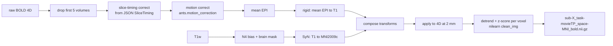

# TRIBE v2 Neurodivergent Fine-Tune Plan

As of 2026-09-20. Research record for whether ProFe's neural layer can be extended
from TRIBE v2's neurotypical average to an autistic-group / ADHD-group prediction, and
how to do it. Companion to `GX10_SETUP.md` (inference setup) and
`backend/scripts/precompute_neural/README.md`.

## Goal and verdict

We want ProFe's neural layer to show how a neurodivergent audience (autism or ADHD)
would respond to a slide, not just the neurotypical average that TRIBE v2 ships with.
This is feasible in about one to two weeks of part-time work, not in a hackathon window,
and the gate is data access rather than compute or code.

Three facts decide the shape of the plan:

- **TRIBE v2 is fine-tunable.** Meta released the full training pipeline, and the paper
  itself fine-tunes the model per subject on under an hour of fMRI.
- **The released weights contain no neurodivergent brain.** The subject layers cover 25
  neurotypical adults. Nothing in the checkpoint can be "switched" to autism; new fMRI
  from diagnosed people has to be added.
- **Exactly one public dataset works**: the Child Mind Institute's Healthy Brain Network
  (HBN), where thousands of children with ADHD, autism and other diagnoses watched the
  same two movies in the scanner. The scans are open. The diagnosis labels are behind a
  Data Use Agreement (DUA).

The end product is two extra checkpoints (an autistic-group model and a non-autistic-group
model, or ADHD versus non-ADHD), loaded by the existing precompute script, with the app
showing the difference between their predictions for each slide. The output is a
group-average prediction from children watching cartoons, and it must be labeled that way
everywhere it appears.

## What TRIBE v2 actually supports

Everything needed for fine-tuning is in the public repo; only the fMRI input format and
the job runner need attention.

| Piece | What the repo provides | Where |
| --- | --- | --- |
| Training loop | Lightning-based trainer with `load_checkpoint`, `checkpoint_path`, and `resize_subject_layer` for fine-tuning a pretrained checkpoint on a new subject set | `tribev2/main.py` |
| Config | Defaults: 8-layer, 1152-wide transformer, low-rank head to 20,484 fsaverage5 vertices, MSE loss, OneCycle LR 1e-4, 15 epochs, subject dropout 0.1 | `tribev2/grids/defaults.py` |
| Local entry point | 3-epoch smoke run on one GPU | `python -m tribev2.grids.test_run` |
| Frozen encoders | Llama-3.2-3B (text), V-JEPA2 (video), Wav2Vec-BERT (audio). Features are extracted once and cached to disk; they never train | `main.py` extractors |
| Subject handling | An embedding table sized `n_subjects` at init plus per-subject projection layers. Inference uses `average_subjects=True`, so a fine-tuned checkpoint predicts the mean of its tuned subjects, which is exactly a group model | `tribev2/model.py`, `demo_utils.py` |
| fMRI loader | Accepts a 4D volume in MNI152NLin2009cAsym space or a 2D surface file, and projects volumes to fsaverage5 itself with nilearn `vol_to_surf`. No detrending or normalization is applied, so that has to happen upstream | `tribev2/utils_fmri.py` |
| Study template | A study class yields timelines and builds an events table with `Fmri`, `Video`, `Audio`, `Word` rows (columns: type, start, duration, filepath, frequency, subject, split). The simplest existing one has just Video and Fmri rows | `tribev2/studies/wen2017.py` |
| Reload path | `TribeModel.from_pretrained(<local dir>)` reads `config.yaml` plus `best.ckpt`, the same call the app already uses for the HF checkpoint | `demo_utils.py` |

Two things to know before touching it. The study base class lives in Meta's `neuralset`
package and the job runner in `exca`, whose defaults assume a Slurm cluster, so the config
has to be switched to a local single-GPU run. And the paper's fine-tuning updates the whole
trainable core (transformer, subject layers, head), not just the subject embedding, for one
epoch per subject on at most one hour of data.

The GX10 is not the bottleneck. The trainable part is a few hundred million parameters and
the cached features for a 3.4-minute movie are small. Feature extraction for one video
takes minutes, and a few epochs over roughly 1,500 TRs per subject takes minutes more.

Sources: [tribev2 repo](https://github.com/facebookresearch/tribev2),
[TRIBE v2 paper](https://arxiv.org/abs/2605.04326)

## The dataset: Healthy Brain Network

HBN is the only public dataset that pairs a stimulus TRIBE can encode with neurodivergent
diagnoses. Everything else with autism or ADHD labels (ABIDE, ADHD-200) is resting-state,
which gives an encoding model nothing to learn from, and the adult autism movie datasets
from Germany and Finland are closed under GDPR.

| Fact | Value |
| --- | --- |
| Population | Ages 5 to 21, New York area, thousands of participants; ADHD is the most common diagnosis, autism a few hundred, plus learning disorders and anxiety |
| Movie runs | `task-movieTP` (The Present, 3 min 21 s) and `task-movieDM` (Despicable Me, 10 min) |
| Scan | TR 0.8 s, 2.4 mm isotropic, multiband 6, Siemens 3T; one The Present run is ~98 MB, ~250 volumes |
| Sites | Site-RU (Rutgers, 1,227 rows), Site-CBIC (1,649 rows), Site-SI (mobile), Site-CUNY |
| Imaging access | Open. Plain HTTPS GET from the public FCP-INDI bucket, no login |
| Labels access | Gated. `participants.tsv` per site holds only age, sex, handedness and release. Diagnoses live in the LORIS database behind a DUA |
| Preprocessed movie data | None. The `CPAC_preprocessed` folder (998 subjects) is resting-state only and marked terminated in March 2024 |
| Stimulus files | The Present is a freely available short film. The Despicable Me clip is a copyrighted DVD segment (bedtime scene to rocket launch) that must be sourced and cut by us |

Verified paths, all under `https://fcp-indi.s3.amazonaws.com/data/Projects/HBN/`:

- `MRI/<Site>/participants.tsv` for the subject list per site
- `MRI/<Site>/<sub>/func/<sub>_task-movieTP_bold.nii.gz` plus its `.json` sidecar
- `MRI/<Site>/<sub>/func/<sub>_task-movieDM_bold.nii.gz`
- `MRI/<Site>/<sub>/anat/<sub>_acq-HCP_T1w.nii.gz`

Listing works with the S3 XML API
(`?prefix=data/Projects/HBN/MRI/Site-RU/&delimiter=/`), so no AWS CLI is needed.

Prior art on this exact data: a 2026 preregistered study fit encoding models on 108
autistic and 63 non-autistic HBN participants and found a modest shift in posterior STS
toward low-level visual features in autism, with no hyper-encoding in primary sensory
cortex. Expect group effects to be small relative to individual variation.

Sources: [HBN data paper](https://www.nature.com/articles/sdata2017181),
[HBN S3 docs](http://fcon_1000.projects.nitrc.org/indi/s3/index.html),
[HBN phenotypic access](https://fcon_1000.projects.nitrc.org/indi/cmi_healthy_brain_network/Phenotypic.html),
[autism encoding preprint](https://pmc.ncbi.nlm.nih.gov/articles/PMC13041991/)

## Phase 0: get the labels

File the HBN Data Use Agreement first, because nothing neurodivergent can be trained until
it clears, and everything else in this plan can run in parallel while waiting.

1. Download the DUA template from the
   [HBN phenotypic access page](https://fcon_1000.projects.nitrc.org/indi/cmi_healthy_brain_network/Phenotypic.html)
   and submit it to Child Mind Institute. It asks for an institution and a signatory; a
   university affiliation is the normal route.
2. On approval, request a LORIS account at data.healthybrainnetwork.org.
3. Export two instruments from LORIS: `Diagnosis_ClinicianConsensus` (the labels to use)
   and `Basic_Demos`. Keep `Diagnosis_KSADS` as a cross-check.
4. Join on participant ID against the site `participants.tsv` files to get the subjects
   who have both a diagnosis and a movie run. Note that `participants.tsv` carries a
   `Full_Pheno` column; only rows marked Yes will have consensus diagnoses.

Turnaround is not published. Plan on days to a couple of weeks. Until it clears,
everything below is a pipeline proof on unlabeled subjects.

## Phase 1: pick subjects and download

Start with The Present only, at one site, because the film is free, the run is short, and
a single scanner removes a confound. Add Despicable Me later for three times the training
data per subject.

**Subject selection.** Pull `MRI/Site-RU/participants.tsv`, then list each subject's
`func/` folder through the S3 XML API and keep those with both `task-movieTP_bold.nii.gz`
and `anat/*_T1w.nii.gz`. For the pipeline proof, take six. For the real run, take every
labeled subject in the two groups, matched on age and sex, and expect to lose about a
third to head motion after quality control (the 2026 preprint ended with 108 plus 63 from
a larger pool).

**Download.** One `curl` per file, in parallel, into a BIDS-shaped tree on the GX10:

```
hbn_raw/
  sub-NDARxxxx/
    anat/sub-NDARxxxx_acq-HCP_T1w.nii.gz
    func/sub-NDARxxxx_task-movieTP_bold.nii.gz
    func/sub-NDARxxxx_task-movieTP_bold.json
```

Budget about 130 MB per subject for The Present plus T1, so 100 subjects is 13 GB. Keep
the JSON sidecars; they carry `SliceTiming` and `RepetitionTime`.

**Stimulus.** Fetch The Present (Jacob Frey, 2014) from its
[public upload](https://www.youtube.com/watch?v=C_nJJHaNmnY) and cut to the first
3 min 21 s. This cut is an assumption: HBN reports the clip length but not the exact in
and out points, and the run has a few seconds of lead-in before the film starts. The
alignment has to be recovered empirically in Phase 4 by scanning a small onset offset
(0 to 10 s) and keeping the one that maximizes the validation encoding score in visual
cortex. Write the film to `stimuli/movieTP.mp4` and extract 16 kHz mono audio to
`stimuli/movieTP.wav`.

Open question for the DUA period: CMI has shared the exact HBN stimulus clips with
researchers before. Ask for them in the DUA correspondence.

## Phase 2: preprocess to MNI space

TRIBE only needs a motion-corrected, MNI152NLin2009cAsym-normalized 4D volume; it does the
surface projection itself. That lets us skip fMRIPrep, which matters because fMRIPrep
ships amd64 images only and the GX10 is arm64 with no working Docker path.

Two routes:

| Route | Where it runs | Per subject | Quality | When to use |
| --- | --- | --- | --- | --- |
| fMRIPrep with `--output-spaces MNI152NLin2009cAsym` | Any amd64 Linux box with Docker, or a cloud VM | 1 to 2 h CPU | Reference standard, includes fieldmap correction and confounds | The real labeled run, if an amd64 machine is available |
| ANTsPy plus nilearn script | The GX10, 20 ARM cores, all subjects in parallel | 10 to 25 min | Good enough for a group-level encoding model | Pipeline proof, and fallback for the real run |

The ANTsPy route, in a separate venv (never the TRIBE venv, which pins numpy):



Each subject's BOLD goes through one composed transform to MNI, then gets cleaned in MNI
space because TRIBE applies no detrending of its own.

Specifics that will bite:

- Get the MNI152NLin2009cAsym 2 mm template and brain mask from `templateflow` so the
  space string matches what TRIBE's loader expects.
- Save the framewise displacement series from the motion parameters. Exclude any run with
  mean FD above 0.5 mm; children move, and this is the main QC gate in every HBN paper.
- Run `nilearn.image.clean_img` with `detrend=True, standardize='zscore_sample'`, a
  high-pass of 0.01 Hz, and the six motion parameters as confounds. Do not band-pass; the
  signal TRIBE predicts is the slow evoked response.
- Resample to 2 mm, not the native 2.4 mm, so `vol_to_surf` samples the cortex at the
  resolution TRIBE's training data used.
- Verify one subject visually: overlay the mean MNI-space EPI on the template with
  nilearn's `plot_epi`. If the cortex is off by a voxel or two the encoding score will
  silently be near zero.

With 20 cores and about four threads per ANTs job, five subjects run concurrently, so 100
subjects is roughly 6 to 8 hours of wall time on the GX10.

## Phase 3: write the HBN study class

One new file, `tribev2/studies/hbn.py`, cloned from `wen2017.py`, plus one import line in
`studies/__init__.py`. The class turns the preprocessed tree into the events table TRIBE
trains on.

What it has to yield:

| Method or attribute | Value for HBN |
| --- | --- |
| `device` | `"Fmri"` |
| `TR_FMRI_S` | `0.8` (read from the JSON, but pin it) |
| `iter_timelines()` | One dict per (subject, task) with keys `subject`, `task`, `group` where the group is `asd`, `adhd`, `control` or `unlabeled` from the LORIS join |
| `_load_timeline_events()` | Four rows: `Video` (filepath `stimuli/movieTP.mp4`, start = onset offset), `Audio` (the wav, same start), `Fmri` (filepath to the MNI nii.gz, start 0, frequency 1.25 Hz, duration = volumes × 0.8), and `Word` rows from a Whisper transcript with word timestamps |
| `split` | Time-based, not subject-based: the first 80 percent of each run is train, the last 20 percent is test. Every subject contributes to both, which is what a group model needs |
| `_download()` | Leave `NotImplementedError`; Phase 1 handles it |

Three design decisions:

- **Group selection happens by filtering timelines, not by a new model input.** To train
  the autistic-group checkpoint, the study yields only `asd` timelines; for the control
  checkpoint, only `control`. TRIBE's average-subject inference then gives the group mean
  for free. This avoids modifying the model and keeps the two checkpoints directly
  comparable.
- **The Word rows matter.** Our slides are narration-driven, and the paper shows text is
  the strongest modality for language cortex. Run Whisper on the wav once and cache the
  word list.
- **Onset offset is a study parameter.** Expose it so Phase 4 can sweep it.

Register the study name in the config (`data.study.names: ["HBN"]`) and point
`data.study.path` at the preprocessed tree. Confirm the loader picks up the 4D volume
branch of `utils_fmri.py` by running one timeline through `study.run()` in a notebook and
checking the resulting array is (20484, T).

## Phase 4: fine-tune from the pretrained checkpoint

The run is short; the work is configuration and validation. Everything below runs inside
the TRIBE venv on the GX10 that already does inference.

**Config.** Copy `grids/test_run.py` to a `finetune_hbn.py` and change these keys:

| Key | Value | Why |
| --- | --- | --- |
| `infra.cluster` | `"local"` (or `None`) | The defaults assume Slurm; the GX10 is one machine |
| `infra.gpus_per_node` | `1` | Keeps the strategy on `auto`, not FSDP |
| `data.study.names` | `["HBN"]` | The new study only |
| `load_checkpoint` / `checkpoint_path` | `true`, path to the downloaded `best.ckpt` from `facebook/tribev2` on Hugging Face | Start from the pretrained weights |
| `resize_subject_layer` | `true` | The checkpoint has 25 subject slots; HBN adds new ones |
| `n_epochs` | `3` to `5` | The paper used 1 epoch per subject on more data; a few passes on 3.4 min is comparable |
| `lr` / `max_lr` | `3e-5` | A third of the from-scratch rate; the transformer is already trained |
| `save_checkpoints` | `true` | Needed to export |

**Order of runs.**

1. Unlabeled smoke run on 6 subjects. Success is the loop completing and validation loss
   going down. Do this before the DUA clears.
2. Onset sweep on those 6: offsets 0, 2, 4, 6, 8, 10 s. Keep the one with the best
   held-out correlation in early visual vertices. Do not skip this; a wrong offset makes
   every later result noise.
3. Control-group run on all labeled controls.
4. Autistic-group run (or ADHD) on the same config.
5. Sanity check: fine-tune a third model on a random half-and-half mix. Its predictions
   should sit between the two group models. If it does not, the group difference is site
   or motion, not diagnosis.

**Export.** Each run writes a Lightning `.ckpt`. Put `best.ckpt` and the run's resolved
`config.yaml` in a folder such as `checkpoints/hbn-asd/`, which is exactly what
`TribeModel.from_pretrained` expects for a local path.

**What to record per run**, because the Methods panel has to show it: subject count after
QC, mean framewise displacement, chosen onset offset, epochs, held-out vertex-wise
correlation for the group model versus the untouched base model. The base model's score
on HBN children is the zero-shot baseline and it is the number that justifies fine-tuning
at all.

Timing on the GX10: feature extraction for one 3.4-minute film is a few minutes and is
shared across all subjects. A 5-epoch run over 100 subjects is on the order of 20 to 40
minutes.

## Phase 5: plug the group checkpoints into ProFe

The app changes are small because the precompute script already isolates the model call.
The product surface is a difference map per slide, never a standalone "autistic brain"
render.

- **Precompute.** `backend/scripts/precompute_neural/run.py` gains a `--checkpoint`
  argument that is passed to `TribeModel.from_pretrained`. Run it once per checkpoint per
  deck: base, `hbn-control`, `hbn-asd`. Outputs land in
  `backend/fixtures/neural/<run_id>/<slide>/<checkpoint>/` so the existing cache reader
  needs only a path change.
- **Metrics.** Alongside `language_drive` and `visual_drive` for each checkpoint, store
  `group_delta` per region as the signed difference of the two group models, and the base
  model's numbers as the reference. Spec rule 5 applies: compare ranks within the deck,
  never absolute values across decks.
- **Rendering.** A fifth image set: the group delta on the surface, symmetric colormap
  about zero, with the burned-in label reading "Predicted group difference (ASD minus
  control), simulated, not measured" instead of the current disclosure text. The existing
  four views stay the base model.
- **Neural tab.** Add a toggle: base, control group, ASD group, difference. Default stays
  base. The Methods panel shows the run record from Phase 4: subject counts, mean FD,
  onset offset, held-out correlation for each model.
- **Never a scalar.** Spec rule 3 still holds. No "neurodivergent engagement score". The
  click-through is region drive per checkpoint, back to the slide text and the narration
  transcript.

## Risks, ranked

| # | Risk | Likelihood | What it costs | Mitigation |
| --- | --- | --- | --- | --- |
| 1 | DUA delayed or refused (needs an institutional signatory) | Medium | Blocks every labeled run | File on day one; ask a faculty contact to sign; run the unlabeled pipeline proof meanwhile |
| 2 | Training internals undocumented: `neuralset` study base class and `exca` job runner default to Slurm | High | One to two days of debugging | Start from `test_run.py`, read `main.py` and `pl_module.py` end to end before writing the study class |
| 3 | Stimulus onset unknown for The Present | High | Silent near-zero encoding scores | Onset sweep in Phase 4 step 2; ask CMI for the exact clip |
| 4 | ANTsPy wheels or performance on arm64 | Low to medium | Preprocessing route fails | Fall back to fMRIPrep on any amd64 laptop or a cloud VM |
| 5 | Group effect too small to see after averaging | Medium | The difference map looks like noise | Report it honestly in the Methods panel; the half-and-half sanity model tells you if the signal is real |
| 6 | Head motion removes most of the autistic group | Medium | Small n, wide error bars | Use FD threshold 0.5 mm, take both movies, add Site-CBIC |
| 7 | Age confound: HBN is children, TRIBE was trained on adults, ProFe's audience is adults | Certain | Every result is an extrapolation | Age-match the two groups so the difference is diagnosis, not age; label the extrapolation on the image |
| 8 | License: TRIBE weights are CC-BY-NC-4.0, HBN is research-only | Certain | Non-commercial only | Fine for the project; flag before any commercial use |

## Timeline and labeling rules

About two weeks part-time for one person, with the DUA wait overlapping the technical work.

| Day | Work | Gate |
| --- | --- | --- |
| 1 | File DUA. Download 6 unlabeled Site-RU subjects and the film. Write the ANTsPy preprocessing script | Six MNI-space runs pass the visual overlay check |
| 2 to 3 | Write `hbn.py`, switch the config to local, get `test_run` through on the 6 subjects from the pretrained checkpoint | Validation loss decreases; export loads back through `from_pretrained` |
| 4 | Onset sweep. Wire `--checkpoint` into the precompute script and render a base-versus-tuned difference for one slide | The pipeline proof slide for the demo |
| DUA clears | Join LORIS diagnoses to the site tables. Select age- and sex-matched groups. Download and preprocess ~100 subjects | Roughly 6 to 8 h of GX10 wall time |
| +1 | Control, ASD, and half-and-half runs. Record the run table | Held-out correlations logged |
| +2 | Precompute the sample decks with all three checkpoints. Neural tab toggle and Methods panel | Demo-ready |

Rules for anything that ships, from spec section 3 and this plan:

- Every image carries "predicted group difference, simulated, not measured" burned in,
  plus the subject count.
- The Methods panel says in one line that the groups are children aged 5 to 21 watching a
  short film, and that the slide prediction is an extrapolation.
- No scalar score, no "engagement", no per-person claim. The unit of output is a region, a
  checkpoint, and the source text that drove it.
- "Autistic group model" and "control group model" are the names. Never "the autistic
  brain".

## Sources

- [tribev2 repo](https://github.com/facebookresearch/tribev2)
- [TRIBE v2 paper](https://arxiv.org/abs/2605.04326)
- [HBN data paper](https://www.nature.com/articles/sdata2017181)
- [HBN S3 access](http://fcon_1000.projects.nitrc.org/indi/s3/index.html)
- [HBN phenotypic access](https://fcon_1000.projects.nitrc.org/indi/cmi_healthy_brain_network/Phenotypic.html)
- [HBN autism encoding preprint](https://pmc.ncbi.nlm.nih.gov/articles/PMC13041991/)
- [fMRIPrep arm64 issue](https://github.com/nipreps/fmriprep/issues/3397)
- [The Present (Jacob Frey, 2014)](https://www.youtube.com/watch?v=C_nJJHaNmnY)
